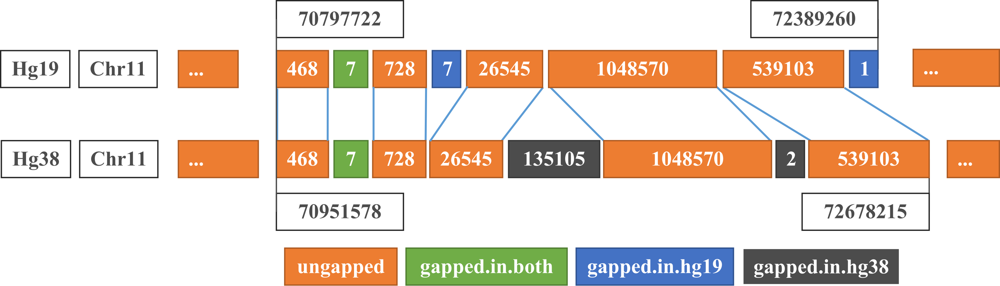
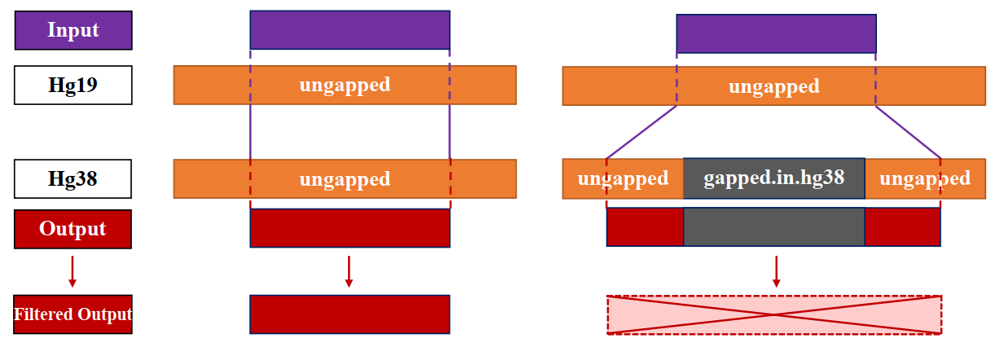
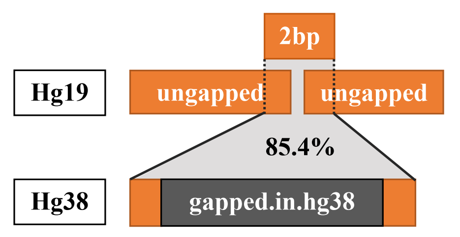
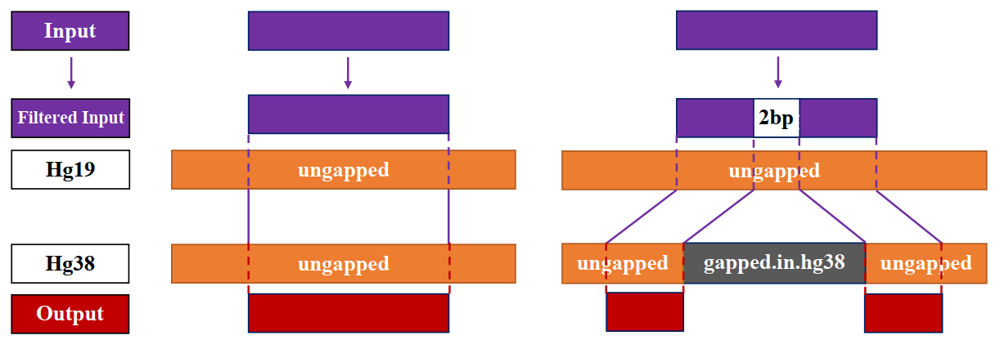
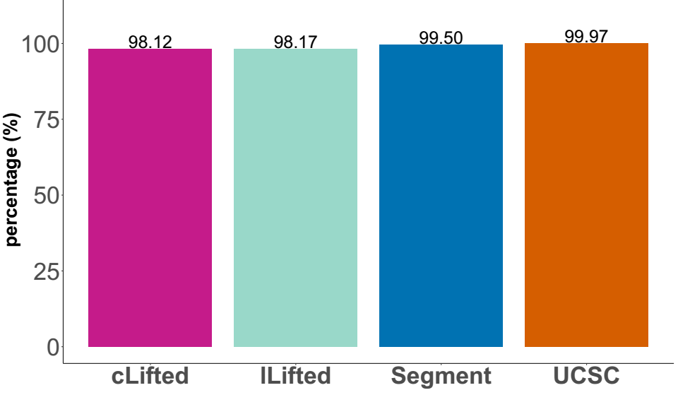
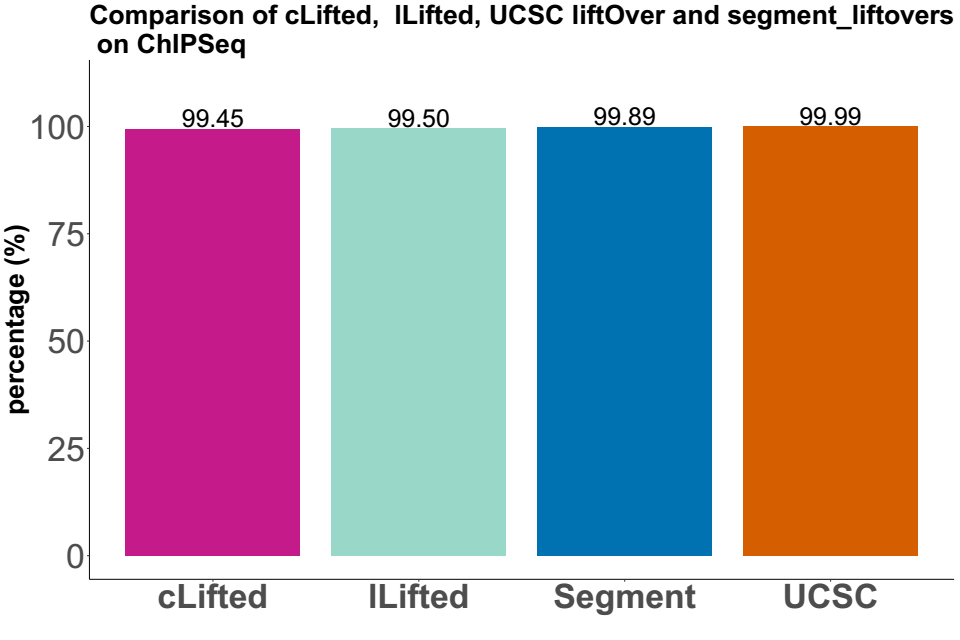
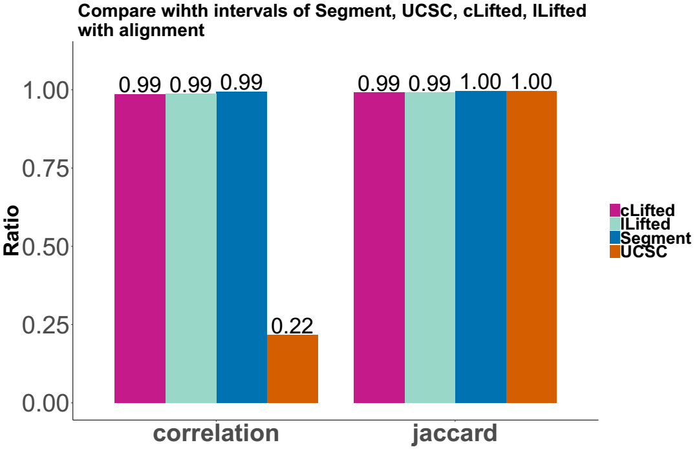

# Lifted 
Compared to re-alignment approaches, liftover is a more rapid and cost-effective solution. To further increase the accuracy of liftover epigenome (WGBS and ChIP-Seq) and avoid misleading results, we implemented a three-step procedure to remove problematic regions (Figure 1) and ensure a more robust conversion between reference genome assemblies, namely, *Lifted*.

#### Figure 1. Explanation of gapped-in-hg19, gapped-in-both, gapped-in-hg38 and ungapped

*Lifted* gets inputs (BED files containing coordinates in hg19) and chain file (hg19ToHg38 from UCSC Genome Browser/NCBI) to generate BED files containing coordinates in hg38.

## Dependencies of *Lifted*:
* *UCSC liftOver*
* *bedtools*

## Three-step procedure of *Lifted* for WGBS:
### *cLifted_CpG* (conservative *Lifted*)
* First, *Lifted* removes all the gapped regions that cause corruption, including gapped-in-hg19, gapped-in-both (these regions are explained in Figure 1) and blacklist with *bedtools*.
* Second, the remaining coordinates are all ungapped on hg19 and then are ready to be converted by *UCSC liftOver*.
* Third, the inappropriate data such as duplication, alternative chromosome and not CG are removed. All output coordinates that overlap with gapped-in-hg38 are also removed by *bedtools*.

### *lLifted_CpG* (less conservative *Lifted*)
* First, *Lifted* removes all the gapped regions that cause corruption, including gapped-in-hg19, gapped-in-both, gapped-in-hg38 and blacklist with *bedtools*. For gapped-in-hg38, the input intervals in hg19 that overlap the coordinates of gapped-in-hg38 are split before liftover to cut out 2bp as presented in Figure 2.
* Second, the remaining coordinates are all ungapped on hg19 and then are ready to be converted by *UCSC liftOver*.
* Third, the inappropriate data such as duplication, alternative chromosome and not CG are removed by *bedtools*.

## Three-step procedure of *Lifted* for ChIP-Seq:
### *cLifted_interval* (conservative *Lifted*)
* First, *Lifted* removes all the gapped regions that cause corruption, including gapped-in-hg19, gapped-in-both (these regions are explained in Figure 1) and blacklist with *bedtools*.
* Second, the remaining coordinates are all ungapped on hg19 and then are ready to be converted by *UCSC liftOver*.
* Third, the inappropriate data such as duplication and alternative chromosome are removed. All output coordinates that overlap with gapped-in-hg38 are also removed by *bedtools*.

#### Figure 2. Two scenarios of liftover with *cLifted* (1) interval does not cross gapped-in-hg38, (2) interval crosses gapped-in-hg38.

### *lLifted_interval* (less conservative *Lifted*)
* First, *Lifted* removes all the gapped regions that cause corruption, including gapped-in-hg19, gapped-in-both, gapped-in-hg38 and blacklist with *bedtools*. For gapped-in-hg38, the input intervals in hg19 that overlap the coordinates of gapped-in-hg38 are split before liftover to cut out 2bp as presented in Figure 2.
* Second, the remaining coordinates are all ungapped on hg19 and then are ready to be converted by *UCSC liftOver*.
* Third, the inappropriate data such as duplication and alternative chromosome are removed by *bedtools*.

#### Figure 3. Intervals in hg19 that overlap the coordinates of gapped-in-hg38 are split

#### Figure 4. Two scenarios of liftover with *lLifted* (1) interval does not cross gapped-in-hg38, (2) interval crosses gapped-in-hg38.

## Requirements
### Requirements of inputs:
* Input BED files must have format: chromosome, start, end.
* Download chain file http://hgdownload.soe.ucsc.edu/goldenPath/hg19/liftOver/

### Requirements of dependencies:
* Download and install *UCSC liftOver* from http://hgdownload.soe.ucsc.edu/admin/exe/. *UCSC liftOver* needs to be exported:
export PATH=$PATH:/path/to/file/liftOvertool/
* Download and install *bedtools* from https://bedtools.readthedocs.io/en/latest/
* Coordinates of filtered regions/positions are available at data folder (gapped-in-hg19.bed, gapped-in-both.bed, gapped-in-hg38.bed, duplication.bed, blacklist.hg19.bed and notCG.bed).

## Command to run *Lifted*
### Conservative *Lifted* for WGBS:
sh cLifted_CpG.sh <chain_file> <input.bed> <output.lifted.bed> <output.unlifted.bed>
### Less conservative *Lifted* for WGBS:
sh lLifted_CpG.sh <chain_file> <input.bed> <output.lifted.bed> <output.unlifted.bed>
### Conservative *Lifted* for ChIP-Seq:
sh cLifted_interval.sh <chain_file> <input.bed> <output.lifted.bed> <output.unlifted.bed>
### Less conservative *Lifted* for ChIP-Seq:
sh lLifted_interval.sh <chain_file> <input.bed> <output.lifted.bed> <output.unlifted.bed>

## Example 1: On Full CpGs (WGBS) 

*sh Lifted/bin/lLifted_CpG.sh hg19.fullCpGs.bedGraph  hg19ToHg38.over.chain lo19to38.fullCpGs.lLifted.bedGraph  e.l.unmap*

*sh Lifted/bin/cLifted_CpG.sh hg19.fullCpGs.bedGraph  hg19ToHg38.over.chain lo19to38.fullCpGs.cLifted.bedGraph  e.c.unmap*

*liftOver hg19.fullCpGs.bedGraph link/to/file/hg19ToHg38.over.chain  lo19to38.FullCpGs.ucsc.bedGraph unlo19to38.bedGraph*

*segment_liftover -l link/to/liftOver -i input/folder/ -o output/folder/ -c link/to/hg19ToHg38.over.chain -si hg19.fullCpGs.bedGraph -so lo19to38.fullCpGs.segment.bedGraph*

#### Figure 5. Comparison of *Lifted* (*cLifted* and *lLifted*) and *UCSC liftOver*, *segment_liftover* on Full CpGs (WGBS)

## Example 2: On ESR1 (ChIPSeq) 

*sh Lifted/bin/lLifted_interval.sh ESR1.hg19ID.bedGraph  hg19ToHg38.over.chain ESR1.lo19to38.lLifted.bedGraph  e.l.unmap*

*sh Lifted/bin/cLifted_interval.sh ESR1.hg19ID.bedGraph  hg19ToHg38.over.chain ESR1.lo19to38.cLifted.bedGraph  e.c.unmap*

*liftOver  ESR1.hg19ID.bedGraph link/to/file/hg19ToHg38.over.chain  ESR1.lo19to38.ucsc.bedGraph unlo19to38.ESR1.bedGraph*

*segment_liftover -l link/to/liftOver -i input/folder/ -o output/folder/ -c link/to/hg19ToHg38.over.chain -si  ESR1.hg19ID.bedGraph -so ESR1.lo19to38.segment.bedGraph*

#### Figure 6. Comparison of *Lifted* (*cLifted* and *lLifted*) and *UCSC liftOver*, *segment_liftover* On ESR1 (ChIPSeq)

#### Figure 6.1. Jaccard statistic and Pearson correlation coefficients of intervals lengt between the four outputs using *cLifted*, *lLifted*, *segment_liftover* and *UCSC liftOver* on ESR1
