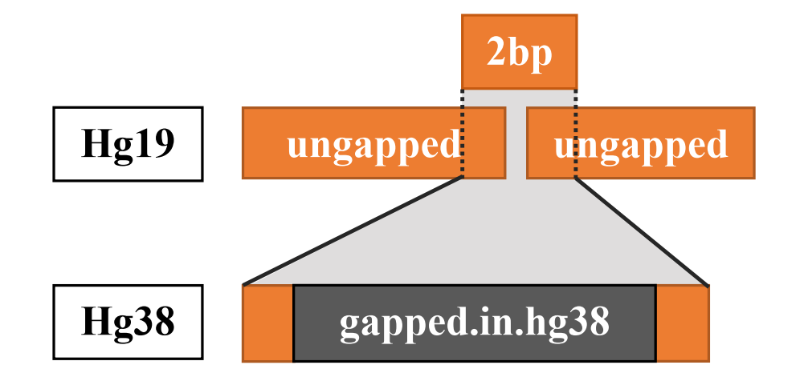

# Lifted 
Compared to re-alignment approaches, liftover is a more rapid and costeffective solution. To further increase the accuracy of liftover epigenome (WGBS and ChIP-Seq) and avoid misleading results, we implemented a three-step procedure to remove problematic regions (Figure 1) and ensure a more robust conversion between reference genome assemblies, namely, Lifted.

Lifted gets inputs (BED files containing coordinates in hg19) and file chain (hg19ToHg38 from UCSC Genome Browser/NCBI) to generate BED files containing coordinates in hg38.

## Dependancies of Lifted:
* UCSC liftOver
* bedtools

## Three-step procedure of Lifted for WGBS:
### cLifted_CpG (conservative Lifted)
* First, Lifted removes all the gapped regions that can cause corruption, including gapped-in-hg19, gapped-in-both (these regions are explained in Figure 1) and blacklist with bedtools.
* Second, the remaining coordinates are all ungapped on hg19 and then are ready to be converted by UCSC liftOver.
* Third, the inappropriate data such as duplication, alternative chromosome and not CG are removed. All output coordinates that overlap with gapped-in-hg38 are also removed by bedtools.

### lLifted_CpG (less conservative Lifted)
* First, Lifted removes all the gapped regions that can cause corruption, including gapped-in-hg19, gapped-in-both, gapped-in-hg38 and blacklist with bedtools. For gapped-in-hg38, the input intervals in hg19 that overlap the coordinates of gapped-in-hg38 are split before liftover to cut out 2bp as presented in Figure 2.
* Second, the remaining coordinates are all ungapped on hg19 and then are ready to be converted by UCSC liftOver.
* Third, the inappropriate data such as duplication, alternative chromosome and not CG are removed by bedtools.

## Three-step procedure of Lifted for ChIP-Seq:
### cLifted_interval (conservative Lifted)
* First, Lifted removes all the gapped regions that can cause corruption, including gapped-in-hg19, gapped-in-both (these regions are explained in Figure 1) and blacklist with bedtools.
* Second, the remaining coordinates are all ungapped on hg19 and then are ready to be converted by UCSC liftOver.
* Third, the inappropriate data such as duplication and alternative chromosome are removed. All output coordinates that overlap with gapped-in-hg38 are also removed by bedtools.

### lLifted_interval (less conservative Lifted)
* First, Lifted removes all the gapped regions that can cause corruption, including gapped-in-hg19, gapped-in-both, gapped-in-hg38 and blacklist with bedtools. For gapped-in-hg38, the input intervals in hg19 that overlap the coordinates of gapped-in-hg38 are split before liftover to cut out 2bp as presented in Figure 2.
* Second, the remaining coordinates are all ungapped on hg19 and then are ready to be converted by UCSC liftOver.
* Third, the inappropriate data such as duplication and alternative chromosome are removed by bedtools.

#### Figure 1. Explanation of gapped-in-hg19, gapped-in-both, gapped-in-hg38 and ungapped

#### Figure 2. Intervals in hg19 that overlap the coordinates of gapped-in-hg38 are split

### Requirement of inputs:
* Input BED files must have format: chromosome, start, end
* Download chain file http://hgdownload.soe.ucsc.edu/goldenPath/hg19/liftOver/

### Requirement of dependencies:
* Download and install *UCSC liftOver* from http://hgdownload.soe.ucsc.edu/admin/exe/. *UCSC liftOver* tool needs to be exported:
export PATH=$PATH:/path/to/file/liftOvertool/
* Download and install *bedtools* from https://bedtools.readthedocs.io/en/latest/
* Coordinates of filtered regions/positions are available at data folder (gapped-in-hg19.bed, gapped-in-both.bed, gapped-in-hg38.bed, duplication.bed and notCG.bed).

## Command to run Lifted
### Conservative Lifted for WGBS:
sh cLifted_CpG.sh <chain_file> <input.bed> <output.lifted.bed> <output.unlifted.bed>
### Less conservative Lifted for WGBS:
sh lLifted_CpG.sh <chain_file> <input.bed> <output.lifted.bed> <output.unlifted.bed>
### Conservative Lifted for ChIP-Seq:
sh cLifted_interval.sh <chain_file> <input.bed> <output.lifted.bed> <output.unlifted.bed>
### Less conservative Lifted for ChIP-Seq:
sh lLifted_interval.sh <chain_file> <input.bed> <output.lifted.bed> <output.unlifted.bed>

### Examples of comparing lifted (*cLifted* and *lLifted*) with *UCSC liftOver*, *segment_liftover* on ESR1 (ChIP-Seq) and full CPGs (WGBS)

##### compare ratio CpGs/intervals chipseq between conservative - less_conservative and segment filtered on Full CpGs and ESR1

##### compare correlation and jaccard ratio intervals chipseq between conservative - less_conservative and segment filtered on ESR1 sample.

